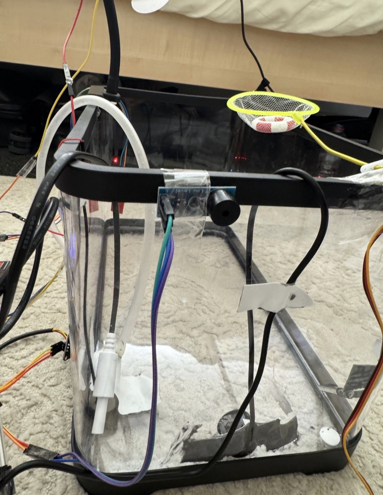
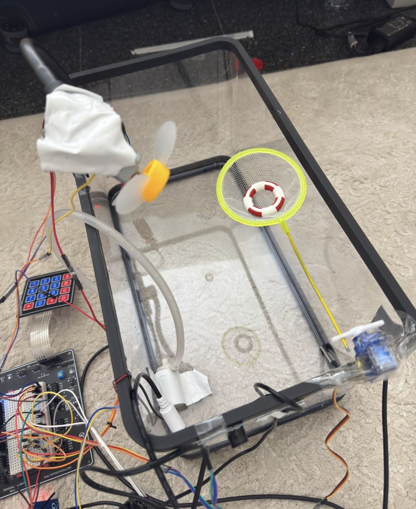
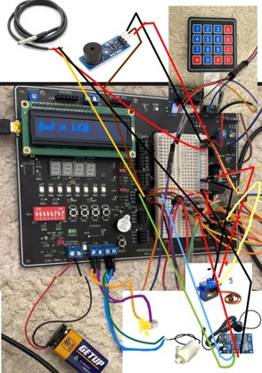
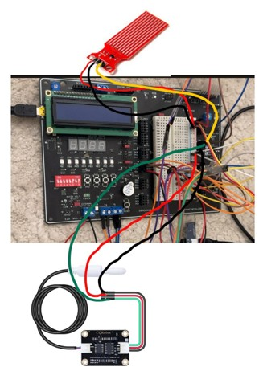
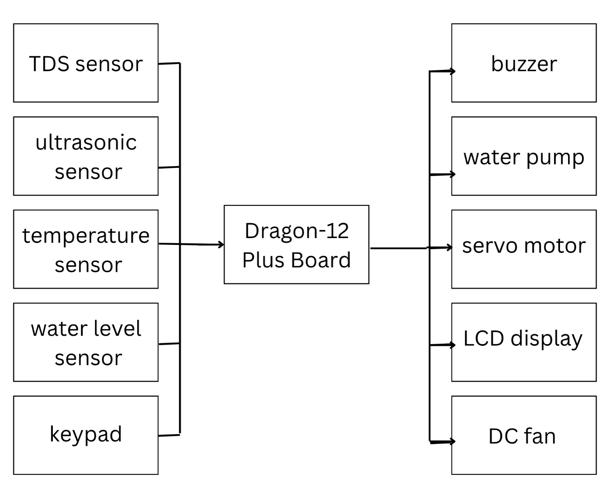

# Smart Pool Safety System

Embedded swimming pool safety and monitoring system built using the **Dragon12-Plus Trainer Board** and programmed in **C**.

The system combines multiple sensors and actuators to monitor pool conditions and respond automatically to potential hazards.

## Features

- Waterproof ultrasonic sensing for possible drowning detection
- Water temperature monitoring using a DS18B20 sensor
- TDS-based water quality measurement
- Water-level monitoring
- Ambient temperature sensing
- Automatic fan control
- LCD status and warning display
- Buzzer-based emergency alert
- Servo-controlled lifebuoy release mechanism
- Water pump control
- Keypad-based user interaction

## Emergency Detection

The system continuously measures distance using a waterproof ultrasonic sensor.

If an object remains within **25 cm for approximately 3 seconds**, the system treats the condition as a possible drowning emergency and:

- displays `!!! DANGER !!!` on the LCD
- activates the buzzer
- runs the water pump
- raises the servo motor to release the lifebuoy

## Hardware

- Dragon12-Plus Trainer Board
- MC9S12DG256 microcontroller
- Waterproof ultrasonic sensor
- DS18B20 waterproof temperature sensor
- TDS sensor
- Water-level sensor
- DC fan
- Water pump
- Servo motor
- Buzzer
- 16×2 LCD
- Hex keypad

## Software

The system was developed in **C** for the HCS12 platform.

Major software components include:

- ultrasonic pulse timing and distance calculation
- 1-Wire communication with the DS18B20
- ADC sensor acquisition
- temperature-compensated TDS calculation
- keypad scanning
- LCD interface
- motor and servo control
- emergency-state logic

## Prototype

  

This project was implemented as a physical prototype representing a swimming pool environment, including a working lifebuoy-release mechanism and connected sensors and actuators.

### Hardware Setup

  

### Pool Safety Mechanism

  
  

### Wiring and Electronics

  
  

## System Architecture

  

The Dragon12-Plus board receives data from the pool sensors, processes the readings, and controls the connected output devices based on the detected conditions.

## Demo Videos

### Quick Demo
Short demonstration showing the full system in operation.

[▶ Watch the 2-minute demo](https://youtube.com/shorts/Rnq7k0bsNPg?feature=share)

### Full Walkthrough
Detailed explanation of the prototype, sensors, system behavior, and emergency response.

[▶ Watch the 4-minute walkthrough](https://youtu.be/G60h4LDBblw)

## Future Improvements

Possible future extensions include:

- IoT-based remote alerts
- data logging
- mobile monitoring
- camera-based drowning detection
- AI-assisted safety monitoring
